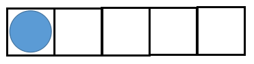
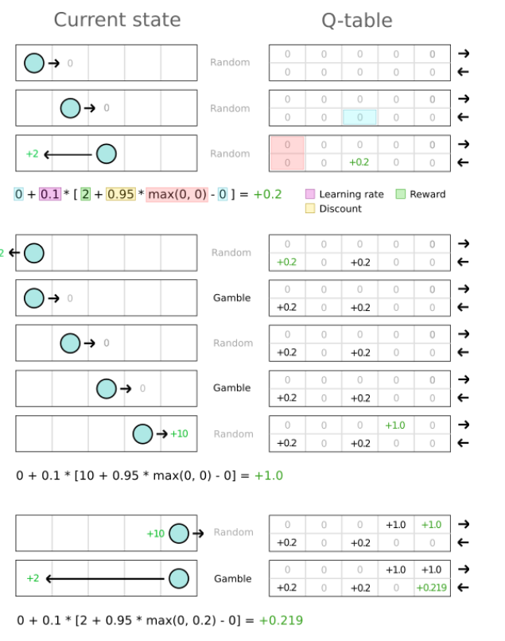

# Reinforcement Learning

## Q-Learning

The algorithm at the heart of Reinforcement Learning is calles Q-Learning.
The Q-value gives us an idea of how valuable an action is, based on the 
immediate reward plus all the future rewards. The formula is given as:

So, the current Q-value is calculated by getting the next reward and 
the difference of the biggest next Q-value and the current one.

An easy example to illustrate the working of this algorithm is the so-called
dungeon game:

This consists of five fields and an agent that is able to perform
two types of actions:

* Forward: take one step to the right
* Backward move pack to the first field from the left

(Source: https://blog.valohai.com/reinforcement-learning-tutorial-part-1-q-learning)

## Deep Q-Learning
The problem with our Q-table is that it is not feasible for problems
with a big state space. So, instead of learning the whole table, we can use
a neural net to approximate these values

(Source: https://blog.valohai.com/reinforcement-learning-tutorial-basic-deep-q-learning)